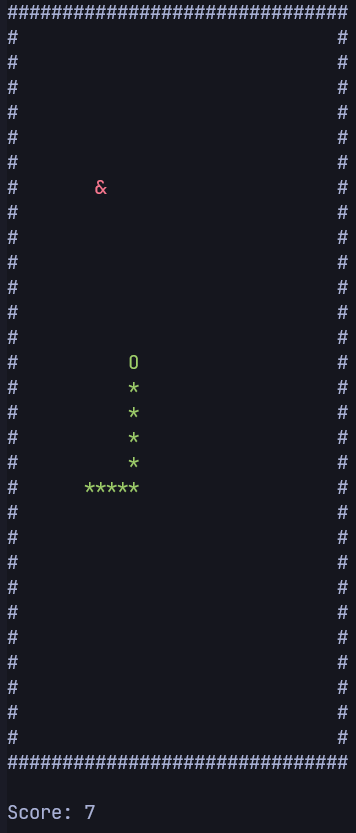

# Snake

A classic Snake game implementation in C++ using the ncurses library. The snake moves around collecting food to grow longer while avoiding walls and itself.

## Preview



## Features

- Multiple food types with different effects:
  - Normal food (red): Increases score by 1 and grows the snake
  - Poison food (green): Decreases score by 1
  - Multiple points food (yellow): Randomly adds 2-10 points
  - Shrink food (blue): Randomly removes 1 or more segments
- High score tracking (in binary format)
- Multiple control schemes:
  - Arrow keys
  - WASD keys
  - HJKL keys (vim-style)

## TODO

- [ ] Fix flickering
- [x] Add audio

## Building and Running

Requirements:

- C++ compiler with C++ 17 support
- ncurses library:

```bash
sudo apt install libncurses-dev ncurses-doc
```

To build and run:

```bash
g++ main.cpp -lncurses -o snake
./snake
```

## License

This project is licensed under [MIT](LICENSE) license.
[Apple_Crunch_18.wav by Koops](https://freesound.org/s/20281/) -- License: Attribution 4.0

